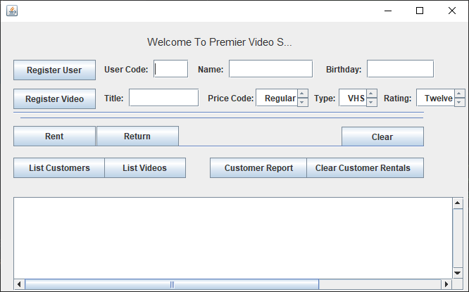
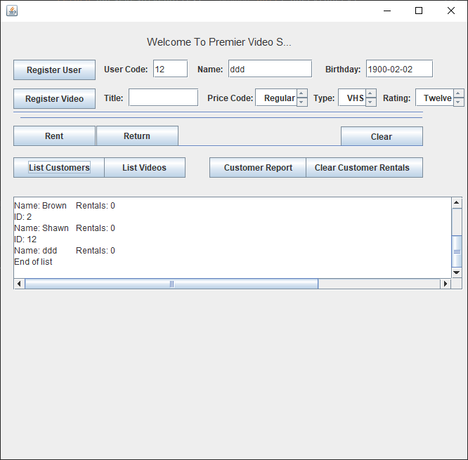
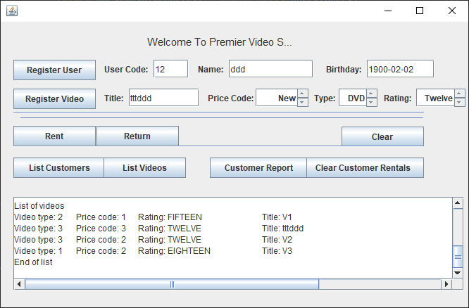

# VideoRental-demo
## 과제

##1. Architecture Refactoring Result
- [x] 미완성 출력문 일부 완성 필요.
- [x] graphic user interface로 돌아가는 것을 캡쳐 해서 보여줘야함.

screenshot

## 2. Smells and Code/Design Level Refactoring(5개)
Description | Smells | Refactoring
------------|--------|------------ 
Video type 별 동작이 달라지는 부분들이 산재되어있음 샷건 | 써저리 스맬  |  stratergy pattern , factory method pattern 적용.

## 3. 느낀점...

## 3. 제출
과제 : B5-과제2,7조

Due : 26 or 27 midnight
